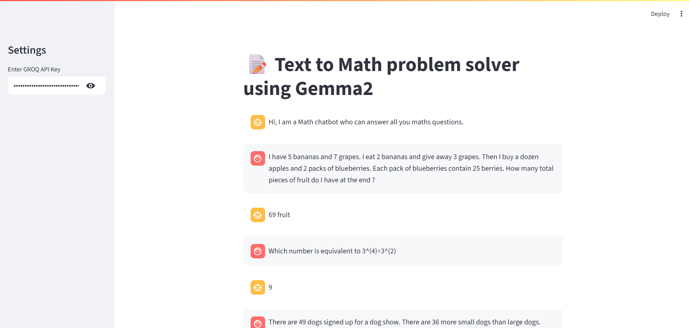

# 📝 Text to Math Problem Solver & Data Search Assistant using Gemma 2

This project is an intelligent assistant built with **Streamlit** and **LangChain**, powered by **Gemma 2 (via Groq API)**. The assistant can solve mathematical word problems, perform logical reasoning, and search for factual data using Wikipedia.

## 🔍 Key Features

- 🧮 **Math Problem Solver**  
  Parses natural language math questions and solves them using a language model and math chain.

- 🧠 **Reasoning Engine**  
  Uses a custom prompt template and LLM chain to provide point-wise explanations for logical reasoning-based questions.

- 🌐 **Wikipedia Search**  
  Integrated Wikipedia API tool to fetch up-to-date facts and information on any topic.

- 💬 **Chat-based Interface**  
  Maintains conversation history for a contextual and interactive experience.

## 📸 App Preview

 <!-- Replace with actual image -->

---

## ⚙️ Tech Stack

- **Frontend**: Streamlit
- **LLM Backend**: Groq's `gemma2-9b-it` model
- **Framework**: LangChain
- **Tools**: Wikipedia API Wrapper, LLM Math Chain
- **Agent Type**: Zero-Shot React Description

---

## 🚀 Getting Started

### 1. Clone the Repository

```bash
git clone https://github.com/anasmalik081/Text-to-Math-problem-solver.git
cd Text-to-Math-problem-solver
```

### 2. Create and Activate a Virtual Environment

```bash
python -m venv venv
source venv/bin/activate  # On Windows use `venv\Scripts\activate`
```

### 3. Install Dependencies

```bash
pip install -r requirements.txt
```

### 4. Run the App

```bash
streamlit run app.py
```

---

## 🔑 API Key Requirement

To use the application, you need a valid **GROQ API Key**.

- You can obtain one from: [https://console.groq.com/](https://console.groq.com/)
- Enter the key in the **Streamlit sidebar** after launching the app.

---

## ✏️ Example Question

```
I have 5 bananas and 7 grapes. I eat 2 bananas and give away 3 grapes. Then I buy a dozen apples and 2 packs of blueberries. Each pack of blueberries contains 25 berries. How many total pieces of fruit do I have at the end?
```

---

## 🧠 Agent Logic

The assistant uses a **multi-tool agent** with the following capabilities:

- **Math Calculation** → via `LLMMathChain`
- **Factual Lookups** → via `WikipediaAPIWrapper`
- **Reasoning & Explanation** → via custom `LLMChain` and prompt template

All tools are integrated through LangChain’s `initialize_agent()` with **Zero-Shot ReAct** strategy.

---

## 📁 Project Structure

```
├── app.py                 # Main Streamlit application
├── README.md              # This file
├── requirements.txt       # Python dependencies (optional)
```

---

## 🙌 Acknowledgements

- [Streamlit](https://streamlit.io/)
- [LangChain](https://www.langchain.com/)
- [GROQ LLMs](https://console.groq.com/)
- [Wikipedia API Wrapper](https://python.langchain.com/docs/integrations/tools/wikipedia/)

---

## ✉️ Contact

For questions, feel free to reach out via [LinkedIn](https://linkedin.com/in/anas-malik-01) or open an issue in the repository.

---
